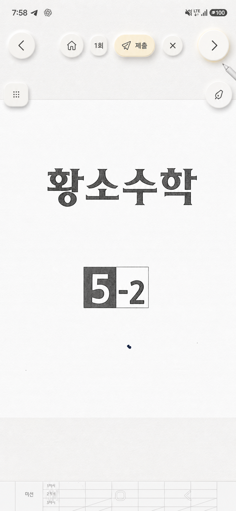
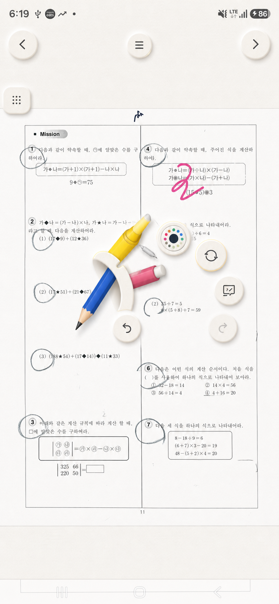
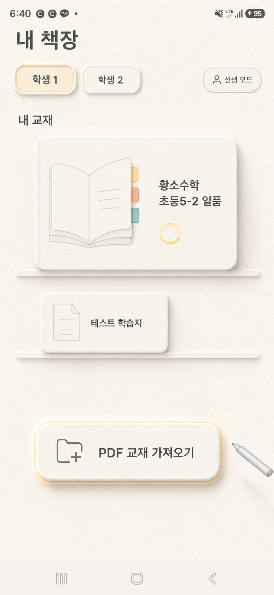

# MasterNote paper-neumorphism target

이 폴더의 PNG는 앱에 직접 넣는 버튼 에셋이 아니라, Compose 구현이 도달해야 할 **재질·빛·그림자 품질 기준**이다.
버튼 배경은 코드로 그리고, 아이콘은 최종적으로 새 벡터/Compose 아이콘으로 교체한다.

## 문제집 버튼

- 따뜻한 아이보리 종이 표면과 아주 미세하고 불규칙한 섬유 결
- 좌상단의 얇고 밝은 모서리와 우하단의 넓고 부드러운 그림자
- 기본 상태는 정지, S펜 호버에서만 약 4~6% 확대·상승
- 호버 테두리는 진한 노랑 선이 아니라 약한 노란 반사광처럼 표현
- 상단 중앙 메뉴는 펼친 뒤 페이지를 이동해도 펼침 상태 유지

## S펜 메뉴

- 현재 120도 배치, 버튼 중심점, 펜·형광펜·지우개·채점 도구의 크기와 뽑힘 동작은 유지
- 도구 자체에는 종이 버튼을 씌우지 않음
- 색상, 확대 초기화, 채점 동작, 되돌리기/다시 실행 같은 **비도구 버튼만** 종이 재질로 변경
- 선택된 도구는 뽑힌 채 고정하고 호버는 일시적으로만 더 올라옴

## 책장

이 그림의 큰 책 표지는 **재질과 그림자 참고용일 뿐 구현 대상이 아니다**.
실제 책장은 현재 코드처럼 큰 그림 없이 제목 중심의 낮은 한 줄 항목으로 유지한다.

- 책 항목: 제목 1줄, 필요할 때만 작은 보조 정보와 이름 변경 동작
- 학생 선택, PDF 가져오기, 페이지 항목도 같은 종이 표면 사용
- 폰에서는 목록 폭을 채우고 태블릿에서는 최대 폭을 제한
- 상태 표시줄과 하단 시스템 내비게이션 안전 영역을 침범하지 않음

## 현재 구현과 시안의 차이

현재 구현은 레이아웃과 상태 동작을 우선 맞춘 1차 버전이다. 다음 작업에서는 아래를 보강한다.

1. 일정한 가로선 대신 매우 약한 비반복 종이 노이즈를 사용한다. Android `RuntimeShader` 또는 작은 무봉제 텍스처를 1~3% 알파로 합성한다.
2. Material 기본 elevation 하나에 의존하지 않고, 밝은 좌상단 림과 서로 다른 blur의 우하단 그림자 두 겹을 분리한다.
3. 호버는 `translationY -2dp`, `scale 1.04~1.06`, 넓어진 그림자와 약한 노란 림을 함께 적용한다.
4. 눌림은 `translationY +1dp`, 작은 세로 squash, 낮아진 외부 그림자와 얕은 내부 음영으로 구분한다.
5. 현재 PNG 아이콘의 단색 tint는 임시 단계다. 최종본에서는 기존 그림을 재사용하지 않고 동일 굵기의 새 벡터 아이콘으로 교체한다.

권장 팔레트:

- 배경: `#F2EEE5`
- 종이 표면: `#FFFCF5`
- 글자/아이콘: `#403D36`
- 가장자리: `#D9D1C3`
- 강조 노랑: `#F2C94C`
